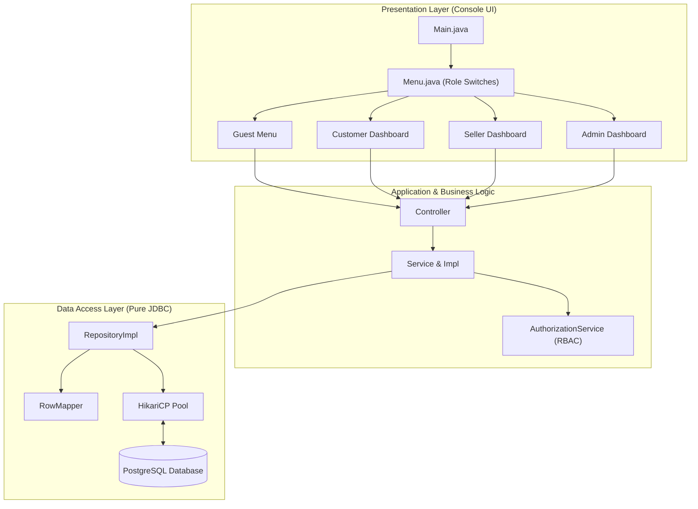

# 👟 ShoesHub — Console E-Commerce Marketplace

> A modular, high-performance console e-commerce application built with **Pure Java (JDBC)**, **PostgreSQL**, and **MVC Architecture**.

---

## 🎯 Project Overview

**ShoesHub** is a terminal-based e-commerce marketplace engineered from the ground up without ORM abstractions. It provides an end-to-end shopping and management experience across 4 distinct user roles: **Guest**, **Customer**, **Seller**, and **Admin**.

### ✨ Core Highlights
* 🛡️ **Pure JDBC & Zero ORM**: 100% standard JDBC with parameterized `PreparedStatement` to prevent SQL injection vulnerabilities.
* 🔄 **ACID Transaction Management**: Atomic multi-table operations (such as Cart Checkout and Inventory Deduction) use manual transaction control with rollback guarantees.
* 🔐 **Enterprise Security**: Industry-standard BCrypt password hashing with role-based session authorization (`ADMIN`, `SELLER`, `CUSTOMER`).
* 📊 **Analytics & Reporting**: Cambodia timezone (`Asia/Phnom_Penh`) sales intelligence with daily revenue breakdowns, top 10 products, low-stock threshold monitoring, and CSV export.
* 📁 **Data Import & Export**: CSV product import (supporting category names and IDs with auto-generated SKUs) and export.
* ⭐ **Interactive Review System**: Star-rendered customer feedback (`★★★★★`), product averages, and admin moderation.

---

## 🎓 Project Mentor

* **Mentor / Instructor**: [@kungsovannda](https://github.com/kungsovannda)

---

## 👥 Developer Team

This project was developed by **Group 2 — ISTAD Full-Stack Web Development Gen 3 (FSWD3)**:

| Member | Role | Core Responsibilities |
| :--- | :--- | :--- |
| **Sim Socheata** | **Team Lead** | Product Feature, Category Management, Variant & Inventory Control |
| **Eav Rotana** | **Team Sub-Lead** | Architecture Design, Database Schema, Code Coordination, Code Review & Refactoring, File I/O (CSV Import/Export), Database Deployment |
| **Pov Kimlong** | **Core Developer** | Authentication & Security (BCrypt), User Management (CRUD & Soft-delete), Shopping Cart Flow |
| **Chour Sothirak** | **Core Developer** | Review & Rating System, Star Visualizer, Sales Reports & Business Analytics |
| **Leang Maneth** | **Core Developer** | Payment Processing (CASH, CARD, KHQR), Transaction History, Payment CSV Exporter |
| **Neourm Sakada** | **Core Developer** | Order Management, Order Items, Checkout Transaction Workflow |

---

## 🛠️ Tech Stack & Dependencies

* **Language**: Java 25+
* **Database**: PostgreSQL 19+
* **JDBC Driver**: `org.postgresql:postgresql:42.7.13`
* **Connection Pool**: HikariCP `5.1.0`
* **Security & Encryption**: BCrypt `org.mindrot:jbcrypt:0.4`
* **Console UI Rendering**: Unicode Box Table Formatter `org.nocrala.tools.texttablefmt:1.2.4`
* **Boilerplate Reduction**: Project Lombok `1.18.48`
* **Build System**: Gradle 9.x

---

## 🌟 Feature Breakdown by User Role

### 1. 🌐 Public / Guest
* Browse active products and view details.
* Search shoes by keyword.
* Filter products by category.
* View customer reviews and average ratings with visual stars (`★★★★★`).
* Register a new customer account with input validation.

### 2. 🛍️ Customer
* **Shopping Cart**: Add shoe variants (validated against real-time stock), modify quantities, remove items, or clear cart.
* **Wishlist**: Save favorite shoes, view wishlist, and move items directly into the cart.
* **Atomic Checkout**: Convert cart into confirmed orders with inventory deduction and order summary receipt generation.
* **Payments**: Complete payments immediately or deferred via **CASH**, **CARD**, or **KHQR**.
* **Order & Transaction History**: Track past orders (`PENDING`, `PAID`, `SHIPPED`, `DELIVERED`, `CANCELLED`).
* **Reviews & Ratings**: Submit ratings (1–5 stars) with comments, edit past reviews, or delete them.

### 3. 🏬 Seller
* **Product Catalog**: Add new shoes and variants (size, color, initial stock).
* **Inventory Control**: Update stock quantities, toggle product active/inactive visibility, and delete variants.
* **Category Browsing**: View categories and products within each section.
* **Order Management**: Monitor store orders and process fulfillment.
* **Customer Feedback**: View product ratings and reviews.

### 4. 👑 Administrator
* **User Management**: Create Admins/Sellers, search users by ID/username, view user table, update profiles, soft-delete, restore, and permanently purge accounts.
* **Review Moderation**: Inspect all platform reviews and remove inappropriate content.
* **Sales Analytics & Reports**: View revenue summaries, daily breakdowns, top 10 bestsellers, category revenue, and low-stock alerts (`stock <= 5`).
* **CSV Export**: Export financial sales reports and full product catalogs to `exports/`.
* **CSV Import**: Bulk-register shoe models from CSV files with auto-generated SKUs and category lookup.

---

## 🏛️ System Architecture

The codebase follows the **Package-by-Feature MVC Pattern** for clean separation of concerns:

```
src/main/java/kh/com/shoeshub/
├── config/              # DBConfig (HikariCP) & ServiceProvider (DI Container)
├── common/              # CrudRepository<T, ID>, RowMapper<T>
├── authorize/           # Security Context & AuthorizationService (RBAC)
├── exception/           # Custom App, Business, Validation, and NotFound Exceptions
├── utils/               # Console InputUtil, OutputUtil, TableUtil, PasswordUtil
├── ui/                  # Menu.java (Role Dashboards & Switchboards)
└── features/
    ├── auth/            # Login, Registration, Session Models
    ├── user/            # User Entity, Repository, Service, Controller, UI
    ├── category/        # Category Management
    ├── product/         # Products, Variants, Stock, CSV Import/Export
    ├── cart/            # Shopping Cart Operations
    ├── wishlist/        # Wishlist Management
    ├── order/           # Order Creation, Items, Receipts, Order Service
    ├── payment/         # Payment Gateways, Status, Receipts
    ├── review/          # Ratings (1-5), Stars Visualizer, Moderation
    └── report/          # Financial Analytics, Cambodia Timezone Queries
```

### High-Level Flow


---

## 🚀 Quickstart & Setup

### 1. Prerequisites
* **Java Development Kit (JDK) 25** or higher installed.
* **PostgreSQL 15+** installed and running.

### 2. Clone the Repository
```bash
git clone https://github.com/rotanaeav/shoeshub_console.git
cd shoeshub_console
```

### 3. Configure Database
1. Create a PostgreSQL database named `shoeshub_db`.
2. Execute the schema script:
   ```bash
   psql -U postgres -d shoeshub_db -f src/main/resources/schema.sql
   ```
3. Configure your database credentials in `src/main/resources/application.properties`:
   ```properties
   db.url=jdbc:postgresql://localhost:5432/shoeshub_db
   db.user=postgres
   db.password=your_password
   ```

### 4. Build & Run
Run the application using the Gradle wrapper:
```bash
./gradlew run
```

---

## 📁 Data Import & Export Formats

### 1. Product CSV Import Format (`imports/products_sample.csv`)
Save your file to `imports/products.csv` using this format:
```csv
name,description,price,category
Nike Air Max 90,Classic running sneaker,135.00,Running
Adidas Ultraboost Light,High performance running shoe,190.00,1
Puma Suede Classic,Vintage lifestyle sneakers,75.50,Sneakers
```
* `sku` is automatically generated sequentially (`SH-0001`, `SH-0002`...).
* `category` supports either the **Category Name** (`Running`, `Sneakers`) or the **Category ID** (`1`, `2`).

### 2. Export Locations
* **Product Catalog**: `exports/products/products_<timestamp>.csv`
* **Sales Analytics**: `exports/sales-<startDate>-<endDate>-<id>.csv`
* **Payment Transactions**: `exports/payments_<timestamp>.csv`
* **Order Receipts**: `exports/order-summary-<orderId>.txt`

---

## 📄 License & Attribution

Special thanks to our mentor **[@kungsovannda](https://github.com/kungsovannda)** for guidance and architectural feedback throughout the project.

Developed with ❤️ by **Group 2 — ISTAD FSWD3**:
* *Sim Socheata*
* *Eav Rotana*
* *Pov Kimlong*
* *Leang Maneth*
* *Chour Sothirak*
* *Neourm Sakada*

© 2026 ShoesHub Engineering Team. All rights reserved.
