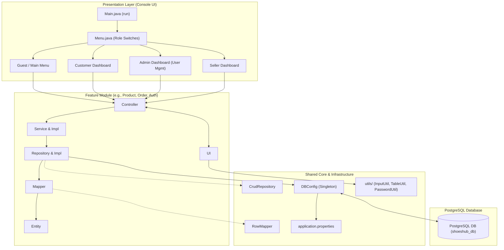
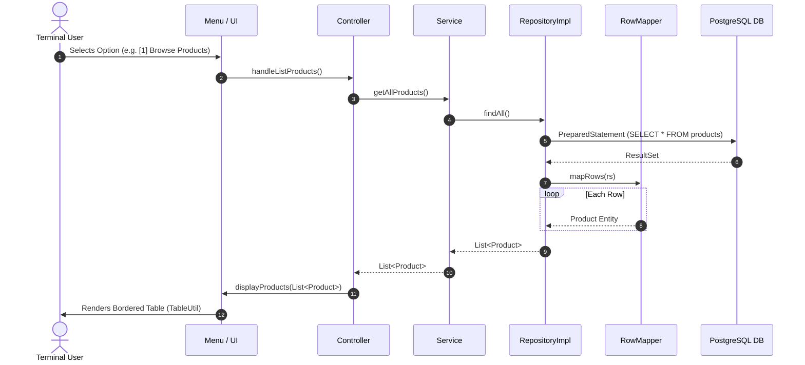

# 👟 ShoesHub — Java JDBC E-Commerce System

> A console-based marketplace application built with **Pure Java (JDBC)**, **PostgreSQL**, and **MVC Architecture**.


## 🎯 Project Overview

* **Tech Stack**:
    * Java 25+
    * Pure JDBC & PostgreSQL Driver (`org.postgresql:postgresql:42.7.13`)
    * Lombok (`org.projectlombok:lombok:1.18.48`)
    * Console Table Formatter (`org.nocrala.tools.texttablefmt:1.2.4`)
    * Password Hashing with BCrypt (`org.mindrot:jbcrypt:0.4`)

---

## 🚀 Quickstart & Setup

### 1. Prerequisites
* **JDK 25** or later installed
* **PostgreSQL** installed and running (Optional)

### 2. Clone Repository
```bash
git clone https://github.com/rotanaeav/shoeshub_console.git
cd shoeshub_console
```

### 3. Initialize Database
Paste given config to `src/main/resources/application.properties` file to use team DB.
*(Or copy and run the contents of `src/main/resources/schema.sql` directly for locale testing).*


### 4. Build & Run
using Gradle command or IntelliJ Run.

### 5. Github & Implement
* **Checkout and create new branch** : conversion: features/<your-feature> and feature/<your-feature/sub-feature
* **PR step by step** : sub-feature → feature → dev→ [leader or sub-leader will check and merge to Main]
* **Don't do anything on main** : you can merge or do anything within your sub-feature and features branch.

---

## 🏛️ Architecture: MVC by Feature

The project is **Package-by-Feature** modular design.

```
features/<feature_name>/
├── <Entity>.java                     # Domain Model (done)
├── mapper/
│   └── <Feature>Mapper.java          # Implements RowMapper<Entity>
├── dto/
│   └── Create<Feature>Request.java   # Request payload from UI
├── repository/
│   ├── <Feature>Repository.java      # Extends CrudRepository<Entity, ID>
│   └── <Feature>RepositoryImpl.java  # JDBC PreparedStatement implementation
├── service/
│   ├── <Feature>Service.java         # Business logic interface
│   └── <Feature>ServiceImpl.java     # Service implementation
├── <Feature>Controller.java          # User choices & actions
└── <Feature>UI.java                  # Console menus and tables
```

---

## 🌟 Reference Sample: Product Feature 

The [`features/product/`](file:///Users/rtn/Documents/Full-Stack-Web-Dev/Java/mini-project-java/src/main/java/kh/com/shoeshub/features/product) module is the **sample template** for all team members.

### 1. Model with Lombok Builder & Data
Encapsulated fields with Lombok builder pattern for immutability and clean instantiation:
```java
@Data
@Builder
@NoArgsConstructor
@AllArgsConstructor
public class Product {
    private UUID id;
    private Short categoryId;
    private String sku;
    private String name;
    private String description;
    private BigDecimal price;
    private boolean active;
    private boolean deleted;
    private Timestamp createdAt;
    private Timestamp updatedAt;
}
```

### 2. Mapper Implementing Generic `RowMapper<T>`
Translates `ResultSet` row into a Java object:
```java
public class ProductMapper implements RowMapper<Product> {
    @Override
    public Product mapRow(ResultSet rs) throws SQLException {
        return Product.builder()
                .id(rs.getObject("id", UUID.class))
                .categoryId(rs.getShort("category_id"))
                .sku(rs.getString("sku"))
                .name(rs.getString("name"))
                .description(rs.getString("description"))
                .price(rs.getBigDecimal("price"))
                .active(rs.getBoolean("is_active"))
                .deleted(rs.getBoolean("is_deleted"))
                .createdAt(rs.getTimestamp("created_at"))
                .updatedAt(rs.getTimestamp("updated_at"))
                .build();
    }
}
```

### 3. Repository Extending Generic `CrudRepository<T, ID>`
Inherits `save`, `findById`, `findAll`, `update`, `deleteById` automatically. Only declare custom feature queries:
```java
public interface ProductRepository extends CrudRepository<Product, UUID> {
    Optional<Product> findBySku(String sku);
    List<Product> findByCategoryId(Short categoryId);
    List<Product> searchByName(String keyword);
}
```

### 4. Clean Querying with `productMapper.mapRows(rs)`
No `while (rs.next())` loop required! Call the inherited `mapRows(rs)` default method:
```java
public class ProductRepositoryImpl implements ProductRepository {
    private final RowMapper<Product> productMapper = new ProductMapper();

    @Override
    public List<Product> findAll() {
        String sql = "SELECT * FROM products WHERE is_deleted = false ORDER BY created_at DESC";

        try (Connection conn = DBConfig.get();
             PreparedStatement stmt = conn.prepareStatement(sql);
             ResultSet rs = stmt.executeQuery()) {

            return productMapper.mapRows(rs); // Reusable single-line mapping!

        } catch (SQLException e) {
            throw new AppException("Failed to query products: " + e.getMessage(), e);
        }
    }
}
```

---

## 👥 Teammate Guide: Implementing Your Feature

Follow this when developing your assigned feature module:

### Step 1: Check your Domain Model
Inspect your entity inside `features/<your-feature>/` (e.g., `User.java`, `Order.java`, `Category.java`).

### Step 2: Create your Mapper
Create `features/<your-feature>/mapper/<Feature>Mapper.java` implementing `RowMapper<Entity>`:
```java
public class CategoryMapper implements RowMapper<Category> {
    @Override
    public Category mapRow(ResultSet rs) throws SQLException {
        return Category.builder()
                .id(rs.getShort("id"))
                .name(rs.getString("name"))
                .description(rs.getString("description"))
                .deleted(rs.getBoolean("is_deleted"))
                .build();
    }
}
```

### Step 3: Implement your Repository
In `repository/<Feature>RepositoryImpl.java`:
1. Use `DBConfig.get()` inside `try-with-resources`.
2. Use `PreparedStatement` with parameterized placeholders (`?`).
3. For custom PostgreSQL enums, cast explicitly in SQL: `?::user_role`, `?::order_status`, `?::payment_method`.
4. Use `mapper.mapRows(rs)` for list queries, or `mapper.mapRow(rs)` for single item lookups.

### Step 4: Implement Service & Controller
1. **Service Layer**: Write business validation (e.g., verify non-negative price, validate unique username).
2. **Controller Layer**: Call the service, catch any `AppException`, and pass output data to the UI.

### Step 5: Connect to the Central Menu
Wire your controller actions into [`kh.com.shoeshub.ui.Menu.java`](file:///Users/rtn/Documents/Full-Stack-Web-Dev/Java/mini-project-java/src/main/java/kh/com/shoeshub/ui/Menu.java) under the appropriate role switch (`Guest`, `Customer`, `Admin`, or `Seller`).

---

## 📜 Core Rules & Requirements

All code submitted to this repository must strictly adhere to the following rules:

### 1. Database & JDBC Rules
* 🚫 **NO ORM Frameworks**: JPA, Hibernate, and Spring Data are strictly forbidden. Use standard Java JDBC.
* 🛡️ **Always Use `PreparedStatement`**: Never concatenate user input directly into SQL strings (`"SELECT ... " + input` is forbidden) to protect against SQL Injection.
* 🔄 **Transaction Management**:
    * Multi-table operations (e.g., **Checkout**: insert order + order items + payment + deduct variant stock + clear cart) must use `conn.setAutoCommit(false)`, `conn.commit()`, and `conn.rollback()` inside a `catch (SQLException e)` block.
* ⏱️ **Timestamp Mapping**: Use `java.sql.Timestamp` for timestamps (`rs.getTimestamp(...)`) and `java.sql.Date` for dates (`rs.getDate(...)`).

### 2. Clean Code & OOP Principles
* **Encapsulation**: All fields private; access via getters, setters, and builders. (done)
* **Abstraction & Interface**: Program to interfaces (`ProductRepository`, `ProductService`, `RowMapper`), not concrete classes.
* **Polymorphism & Generics**: Use `CrudRepository<T, ID>` and `RowMapper<T>`.
* **DRY**: Never re-implement console scanners, table printers, or JDBC while-loops. Use the shared `utils` and `common` packages.

### 3. Modern Java Syntax & File IO
* **Lambdas & Method References**:
    * Favor functional pipelines and method references: e.g., `list.forEach(System.out::println)`, `stream().map(Product::getName).toList()`.
    * In generic collections/mappers: pass functional mappers or reference mapper methods (`this::mapRow`).
* **Switch Expressions (`->`)**:
  ```java
  switch (choice) {
      case 1 -> handleOptionOne();
      case 2 -> handleOptionTwo();
      default -> OutputUtil.printError("Invalid choice");
  }
  ```
* **Modern File IO (Java NIO.2)**:
    * For report generation (e.g., export orders / sales to CSV/invoice): use `java.nio.file.Files`, `java.nio.file.Path`, and `BufferedWriter`:
      ```java
      Path path = Path.of("exports/sales_report.csv");
      try (BufferedWriter writer = Files.newBufferedWriter(path, StandardCharsets.UTF_8)) {
          writer.write("Order ID,Customer,Total,Status\n");
          // write records
      }
      ```
* **Try-with-Resources**: Always auto-close `Connection`, `PreparedStatement`, `ResultSet`, and IO `Reader`/`Writer` streams.

---

## 🧰 Shared Utilities Reference

Always reuse and can add the utilities in [`kh.com.shoeshub.utils`](file:///Users/rtn/Documents/Full-Stack-Web-Dev/Java/mini-project-java/src/main/java/kh/com/shoeshub/utils/):

| Utility Class | Purpose & Core Methods |
| :--- | :--- |
| **`InputUtil`** | Validated terminal scanner:<br>• `readText(prompt)` / `readRequiredText(prompt)`<br>• `readInt(prompt, min, max)` / `readPositiveInt(prompt)`<br>• `readDouble(prompt, min)`<br>• `readConfirm(prompt)` (`[y/n]`)<br>• `readUUID(prompt)`<br>• `readEnum("Title", EnumClass.class)` |
| **`OutputUtil`** | Formatted ANSI console alerts:<br>• `printSuccess(msg)`, `printError(msg)`, `printWarning(msg)`<br>• `printHeader(title)`, `printSubHeader(title)` |
| **`TableUtil`** | Bordered Unicode table rendering:<br>• `createTable(columns, headers...)`<br>• `render(table)` |
| **`PasswordUtil`** | BCrypt security (cost factor 12):<br>• `hashPassword(plain)`<br>• `verifyPassword(plain, storedHash)` |

---
## 🗺️ Project Structure Diagram

### High-Level Architecture Flow


### User Flow


---
*© ISTAD FSWD3 Group2 Team*
*© ShoesHub Engineering Team*

